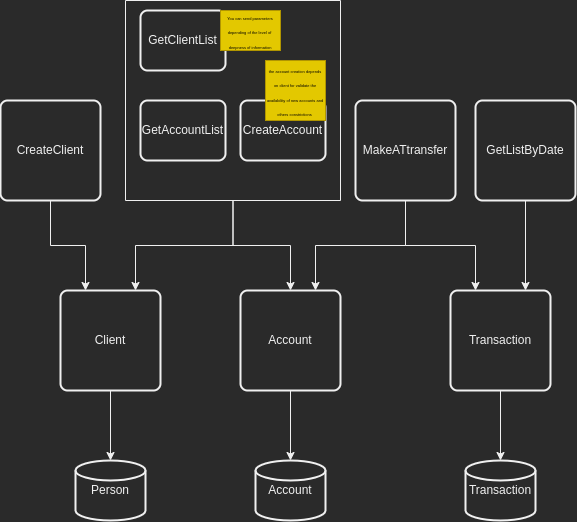
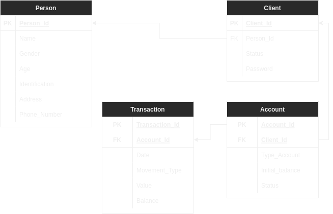

# ATM service

---

## ATM available operations 

### Scope
Descripción..

#### Use Cases

* Create Client

| name | address | phone | password | status |
|------|---------|-------|----------|--------|
|      |         |       |          |        |
|      |         |       |          |        |
|      |         |       |          |        |

#### Out of Scope 
Descripción...
* Caso de uso 1

---
## Architecture

### Diagram
Functional design

Class design

### Data Model

This is E/R Diagram but even if here is a full relation it will be in different Data Bases

---

